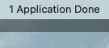
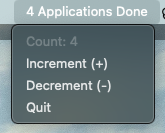

# Applications Counter-App

Simple MacOs menu bar app that acts as a counter. It is bundled as a macos app.

Basic Functions:

* Counter Variable
* Increment, Decrement
* Reset
* Quit

To be Developed:

* Startup at login
* Persistent System variable to hold value even after quitting
* Reset at 12 AM everyday or when machine starts up on a new day.

Issues:

* Launch error with bundled app.

7/30/24

* Added Reset Functionality

* Added non negative lower bound. i.e. Valid counter value range >= 0

7/29/24

Initial Prototype

